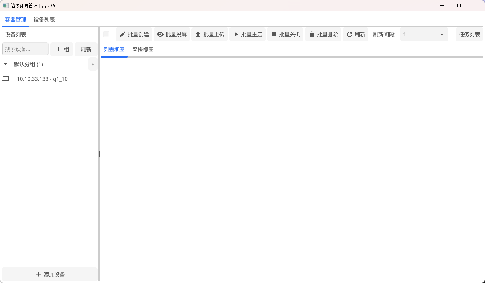

# myt-edgeclient
MYT魔云腾开源客户端ARM边缘计算盒子

# 目录说明

* edgeclient:  客户端主体
* screen:        投屏程序主体
* libs:             MYTRPA库（RPA不开源）

# 支持特性

* 投屏对接RPA的WebRTC的音视频、中文及按键输入、滑动点击、鼠标滚轮滚动（实验性）
* 投屏支持拖拽文件上传，支持多文件拖拽上传，APK拖拽安装
* 客户端本体支持创建、删除、批量多机器创建、上传文件、添加设备、分组
* 客户端添加设备方式V0.4后更改为手动添加模式，V0.3版本是PC客户端模式，默认扫描添加所有设备
* MAC和Win的黑暗模式

# 客户端截图





# 编译指南

## 依赖库准备

### Ubuntu  

```
sudo apt install golang
sudo apt install libavutil-dev libavcodec-dev libswscale-dev libswresample-dev libxinerama-dev libx11-dev libxi-dev libgl-dev gcc libxxf86vm-dev
```

如果Linux编译失败，修改libs/mytrpa/include/libmytrpc.h文件  

```
#define  MYAPI __cdecl
```

改为  

```
#define  MYAPI
```

### MacOSX  

```
xcode-select --install
brew install go
brew install ffmpeg
```

### Windows（待补充）

1. 安装golang
2. 下载ffmpeg：[ffmpeg](https://ffmpeg.org/download.html)
3. 下载gcc：[TDM-GCC](https://jmeubank.github.io/tdm-gcc/)
4. 配置pkgconfig环境

## 编译过程

1. 编译客户端本体  

```
cd edgeclient
go mod init edgeclient
go mod tidy
go build
```

2. 编译投屏程序  

```
cd screen
go mod init screen
go mod tidy
go build
```

3.编译输出

edgeclient/edgeclient
screen/screen

把两个输出结果拷贝到同一个目录，运行./edgeclient即可

4. 注意事项  

网络相关导致的go mod tidy失败或者下载资源失败请自行解决，环境搭建问题自行解决。  

